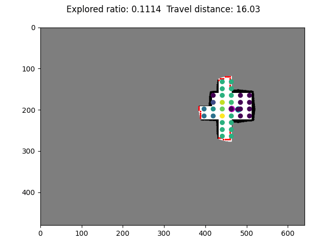
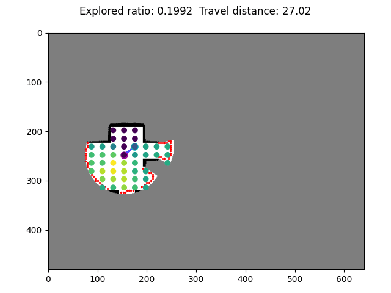
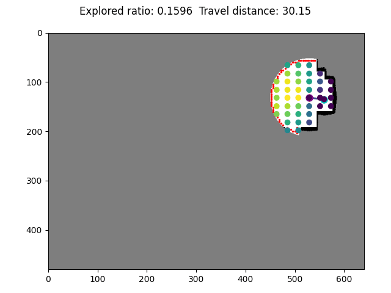
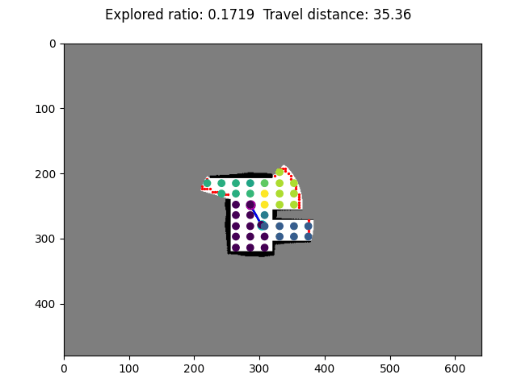

# ARiADNE
Public code and model of <a href="https://arxiv.org/pdf/2301.11575.pdf">ARiADNE: A Reinforcement learning approach using Attention-based Deep Networks for Exploration</a>, which is accepted for the oral presentation at ICRA 2023.

**Note**: This is a new implementation of ARiADNE. 
You can find our original implementation in the [main branch](https://github.com/marmotlab/ARiADNE/tree/main).
We reimplement ARiADNE to optimize the computing time, RAM/VRAM usage, and compatibility with ROS. 
The trained model can be directly tested in our [ARiADNE ROS planner](https://github.com/marmotlab/ARiADNE-ROS-Planner).


## Run

#### Dependencies
We recommend to use conda for package management. 
Our planner is coded in Python and based on Pytorch. 
Other than Pytorch, please install following packages by:
```
pip install scikit-image matplotlib ray tensorboard
```
We tested our planner in various version of these packages so you can just install the latest one.

#### Training
Download this repo and go into the folder:
```
git clone https://github.com/marmotlab/ARiADNE.git
cd ARiADNE
```
Launch your conda environment if any and run:

```python driver.py```

The default training code requires around 8GB VRAM and 20G RAM. 
You can modify the hyperparameters in `parameter.py`.

#### Testing
To test the trained model, you can run:

```python test_driver.py```

This will load the trained model and run the test in the environment.

#### Probable Errors
```
Failed to register worker 01000000ffffffffffffffffffffffffffffffffffffffffffffffff to Raylet.
```
This error is typically related to runtime issues with the `Ray` framework, possibly caused by improper startup of `Ray` processes or conflicts with temporary files. Follow these steps to resolve the issue:
1. Stop the `Ray` service:
```
ray stop
```
2. Remove the `Ray` temporary files:
```
rm -rf /tmp/ray
```
3. Then, restart the `Ray` service:
```
ray start --head
```

## Files
* `parameters.py` Training parameters.
* `driver.py` Driver of training program, maintain & update the global network.
* `runner.py` Wrapper of the workers.
* `worker.py` Interact with environment and collect episode experience.
* `model.py` Define attention-based network.
* `env.py` Autonomous exploration environment.
* `node_manager.py` Manage and update the informative graph.
* `quads` Quad tree for node indexing provided by [Daniel Lindsley](https://github.com/toastdriven).
* `sensor.py` Simulate the sensor model of Lidar.
* `utils.py` Utility functions.
* `test_driver.py` Driver of testing program, load the trained model and run the test.
* `test_worker.py` Interact with environment during testing.
* `test_parameters.py` Testing parameters.
* `/maps` Maps of training environments provided by <a href="https://github.com/RobustFieldAutonomyLab/DRL_robot_exploration">Chen et al.</a>.
* `/gifs` Gifs of the ARiADNE, including the training and testing process.
* `/model` Trained models of ARiADNE.
* `/train` Training logs of ARiADNE.
* `/results` Testing results of ARiADNE.

### Demo of ARiADNE

<div>
   
   
</div>

### Cite
If you find our work helpful or enlightening, feel free to cite our paper:
```
@INPROCEEDINGS{cao2023ariadne,
  author={Cao, Yuhong and Hou, Tianxiang and Wang, Yizhuo and Yi, Xian and Sartoretti, Guillaume},
  booktitle={2023 IEEE International Conference on Robotics and Automation (ICRA)}, 
  title={ARiADNE: A Reinforcement learning approach using Attention-based Deep Networks for Exploration}, 
  year={2023},
  pages={10219-10225},
  doi={10.1109/ICRA48891.2023.10160565}}
```

### Authors
[Yuhong Cao](https://github.com/caoyuhong001)\
Tianxiang Hou\
[Yizhuo Wang](https://github.com/wyzh98)\
Xian Yi\
[Guillaume Sartoretti](https://github.com/gsartoretti)